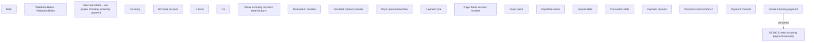

# Create incoming payment - UI

```mermaid
graph TD
    el_1880284["Note"]
    Validation_Rules_Validation_Rules["Validation Rules : Validation Rules"]
    UseCase_Model_vse_projito_Creating_incoming_payment["UseCase Model - vse projito :Creating incoming payment"]
    n_05_080_Create_incoming_payment_manually["05.080 Create incoming payment manually"]
    Currency["Currency"]
    HC_bank_account["HC bank account"]
    Cancel["Cancel"]
    Ok["Ok"]
    Show_incoming_payment_detail_buttons["Show incoming payment detail buttons"]
    Transaction_number["Transaction number"]
    Provided_contract_number["Provided contract number"]
    Payer_personal_number["Payer personal number"]
    Payment_type["Payment type"]
    Payer_bank_account_number["Payer bank account number"]
    Payer_name["Payer name"]
    Import_file_name["Import file name"]
    Deposit_date["Deposit date"]
    Transaction_date["Transaction date"]
    Payment_amount["Payment amount"]
    Payment_channel_branch["Payment channel branch"]
    Payment_channel["Payment channel"]
    Create_incoming_payment["Create incoming payment"]
    Create_incoming_payment["Create incoming payment"]
    Create_incoming_payment -->|unnamed| n_05_080_Create_incoming_payment_manually
```
