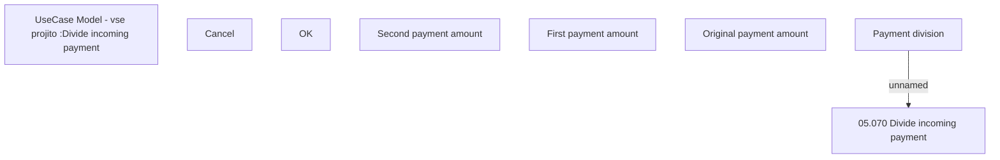

# Divide incoming payment - UI

- **Diagram Type**: Custom
- **Package**: HomerSelect/BSL/Modules/Incoming Payments/Analytical Model/Management of incoming payments/User Interface
- **Diagram ID**: 164560
- **Elements**: 8
- **Connectors**: 1

