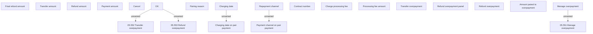

# Manage overpayment

```mermaid
graph TD
    Final_refund_amount["Final refund amount"]
    n_05_553_Refund_overpayment["05.553 Refund overpayment"]
    Transfer_amount["Transfer amount
"]
    Refund_amount["Refund amount"]
    Payment_amount["Payment amount"]
    Cancel["Cancel"]
    OK["OK"]
    Payment_channel_on_pair_payment["Payment channel on pair payment"]
    Charging_date_on_pair_payment["Charging date on pair payment"]
    Pairing_reason["Pairing reason"]
    Charging_date["Charging date"]
    Repayment_channel["Repayment channel"]
    Contract_number["Contract number"]
    Charge_processing_fee["Charge processing fee"]
    Processing_fee_amount["Processing fee amount"]
    n_05_552_Transfer_overpayment["05.552 Transfer overpayment"]
    Cancel["Cancel"]
    OK["OK"]
    Transfer_overpayment["Transfer overpayment"]
    Refund_overpayment_panel["Refund overpayment panel"]
    Transfer_overpayment["Transfer overpayment"]
    Refund_overpayment["Refund overpayment"]
    Amount_paired_to_overpayment["Amount paired to overpayment"]
    n_05_551_Manage_overpayment["05.551 Manage overpayment"]
    Manage_overpayment["Manage overpayment"]
    Manage_overpayment -->|unnamed| n_05_551_Manage_overpayment
    OK -->|unnamed| n_05_552_Transfer_overpayment
    Charging_date -->|unnamed| Charging_date_on_pair_payment
    Repayment_channel -->|unnamed| Payment_channel_on_pair_payment
    OK -->|unnamed| n_05_553_Refund_overpayment
```
