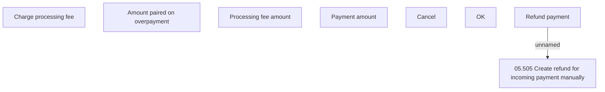

# Refund payment

```mermaid
graph TD
    n_05_505_Create_refund_for_incoming_payment_manually["05.505 Create refund for incoming payment manually"]
    Charge_processing_fee["Charge processing fee"]
    Amount_paired_on_overpayment["Amount paired on overpayment"]
    Processing_fee_amount["Processing fee amount"]
    Payment_amount["Payment amount"]
    Cancel["Cancel"]
    OK["OK"]
    Refund_payment["Refund payment"]
    Refund_payment -->|unnamed| n_05_505_Create_refund_for_incoming_payment_manually
```
