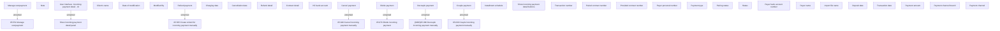

# Show incoming payment detail panel

```mermaid
graph TD
    n_05_551_Manage_overpayment["05.551 Manage overpayment"]
    Manage_overpayment["Manage overpayment"]
    n_05_505_Create_refund_for_incoming_payment_manually["05.505 Create refund for incoming payment manually"]
    el_1880282["Note"]
    User_Interface_Incoming_payment_detail_UI["User Interface :Incoming payment detail - UI"]
    Client_s_name["Client's name"]
    Date_of_modification["Date of modification"]
    Modified_By["Modified By"]
    n_05_030_Couple_incoming_payment_manually["05.030 Couple incoming payment manually"]
    n_05_040_Cancel_incoming_payment_manually["05.040 Cancel incoming payment manually"]
    n_05_070_Divide_incoming_payment["05.070 Divide incoming payment"]
    MOD_05_060_Decouple_incoming_payment_manually["{MOD}05.060 Decouple incoming payment manually"]
    Refund_payment["Refund payment"]
    Charging_date["Charging date"]
    Cancellation_date["Cancellation date"]
    Refund_detail["Refund detail"]
    Contract_detail["Contract detail"]
    HC_bank_account["HC bank account"]
    Cancel_payment["Cancel payment"]
    Divide_payment["Divide payment"]
    Decouple_payment["Decouple payment"]
    Couple_payment["Couple payment"]
    Installment_schedule["Installment schedule"]
    Show_incoming_payment_detail_buttons["Show incoming payment detail buttons"]
    Transaction_number["Transaction number"]
    Paired_contract_number["Paired contract number"]
    Provided_contract_number["Provided contract number"]
    Payer_personal_number["Payer personal number"]
    Payment_type["Payment type"]
    Pairing_status["Pairing status"]
    Status["Status"]
    Payer_bank_account_number["Payer bank account number"]
    Payer_name["Payer name"]
    Import_file_name["Import file name"]
    Deposit_date["Deposit date"]
    Transaction_date["Transaction date"]
    Payment_amount["Payment amount"]
    Payment_channel_branch["Payment channel branch"]
    Payment_channel["Payment channel"]
    Show_incoming_payment_detail_panel["Show incoming payment detail panel"]
    User_Interface_Incoming_payment_detail_UI -->|unnamed| Show_incoming_payment_detail_panel
    Decouple_payment -->|unnamed| MOD_05_060_Decouple_incoming_payment_manually
    Divide_payment -->|unnamed| n_05_070_Divide_incoming_payment
    Cancel_payment -->|unnamed| n_05_040_Cancel_incoming_payment_manually
    Couple_payment -->|unnamed| n_05_030_Couple_incoming_payment_manually
    Refund_payment -->|unnamed| n_05_505_Create_refund_for_incoming_payment_manually
    Manage_overpayment -->|unnamed| n_05_551_Manage_overpayment
```
