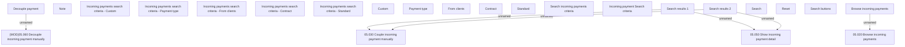

# Browse incoming payments - UI

```mermaid
graph TD
    MOD_05_060_Decouple_incoming_payment_manually["{MOD}05.060 Decouple incoming payment manually"]
    Decouple_payment["Decouple payment"]
    el_1673512["Note"]
    Incoming_payments_search_criteria_Custom["Incoming payments search criteria - Custom"]
    Incoming_payments_search_criteria_Payment_type["Incoming payments search criteria - Payment type"]
    Incoming_payments_search_criteria_From_clients["Incoming payments search criteria - From clients"]
    Incoming_payments_search_criteria_Contract["Incoming payments search criteria - Contract"]
    Incoming_payments_search_criteria_Standard["Incoming payments search criteria - Standard"]
    n_05_050_Show_incoming_payment_detail["05.050 Show incoming payment detail"]
    n_05_030_Couple_incoming_payment_manually["05.030 Couple incoming payment manually"]
    n_05_020_Browse_incoming_payments["05.020 Browse incoming payments"]
    Custom["Custom"]
    Payment_type["Payment type"]
    From_clients["From clients"]
    Contract["Contract"]
    Standard["Standard"]
    Search_incoming_payments_criteria["Search incoming payments criteria"]
    Incoming_payment_Search_criteria["Incoming payment Search criteria"]
    Search_results_2["Search results 2"]
    Search_results_1["Search results 1"]
    Search["Search"]
    Reset["Reset"]
    Search_buttons["Search buttons"]
    Browse_incoming_payments["Browse incoming payments"]
    Decouple_payment -->|unnamed| MOD_05_060_Decouple_incoming_payment_manually
    Browse_incoming_payments -->|unnamed| n_05_020_Browse_incoming_payments
    Search_results_1 -->|unnamed| n_05_030_Couple_incoming_payment_manually
    Search_results_2 -->|unnamed| n_05_030_Couple_incoming_payment_manually
    Search_results_1 -->|unnamed| n_05_050_Show_incoming_payment_detail
    Search_results_2 -->|unnamed| n_05_050_Show_incoming_payment_detail
```
