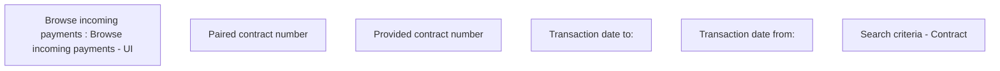

# Incoming payments search criteria - Contract

- **Diagram Type**: Custom
- **Package**: HomerSelect/BSL/Modules/Incoming Payments/Analytical Model/Management of incoming payments/User Interface/Browse incoming payments
- **Diagram ID**: 143108
- **Elements**: 6
- **Connectors**: 0

