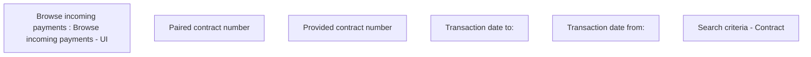

# Incoming payments search criteria - Contract

```mermaid
graph TD
    Browse_incoming_payments_Browse_incoming_payments_UI["Browse incoming payments : Browse incoming payments - UI"]
    Paired_contract_number["Paired contract number"]
    Provided_contract_number["Provided contract number"]
    Transaction_date_to["Transaction date to:"]
    Transaction_date_from["Transaction date from:"]
    Search_criteria_Contract["Search criteria - Contract"]
```
