# Incoming payments search criteria - Standard

- **Diagram Type**: Custom
- **Package**: HomerSelect/BSL/Modules/Incoming Payments/Analytical Model/Management of incoming payments/User Interface/Browse incoming payments
- **Diagram ID**: 143112
- **Elements**: 19
- **Connectors**: 0

```mermaid
graph TD
    Browse_incoming_payments_Browse_incoming_payments_UI["Browse incoming payments : Browse incoming payments - UI"]
    Transaction_number["Transaction number"]
    Paired_contract_number["Paired contract number"]
    Provided_contract_number["Provided contract number"]
    Payer_personal_number["Payer personal number"]
    Payment_type["Payment type"]
    Pairing_status["Pairing status"]
    Status["Status"]
    Payer_bank_account_number["Payer bank account number"]
    Payer_name["Payer name"]
    Import_file_name["Import file name"]
    Transaction_date_to["Transaction date to:"]
    Transaction_date_from["Transaction date from:"]
    Currency["Currency"]
    Maximal_amount["Maximal amount"]
    Minimal_amount["Minimal amount"]
    Payment_channel_branch["Payment channel branch"]
    Payment_channel["Payment channel"]
    Search_criteria_Standard["Search criteria - Standard"]
```

