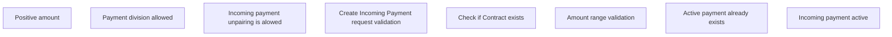

# Validation Rules

```mermaid
graph TD
    Positive_amount["Positive amount"]
    Payment_division_allowed["Payment division allowed"]
    Incoming_payment_unpairing_is_alowed["Incoming payment unpairing is alowed"]
    Create_Incoming_Payment_request_validation["Create Incoming Payment request validation"]
    Check_if_Contract_exists["Check if Contract exists"]
    Amount_range_validation["Amount range validation"]
    Active_payment_already_exists["Active payment already exists"]
    Incoming_payment_active["Incoming payment active"]
```
