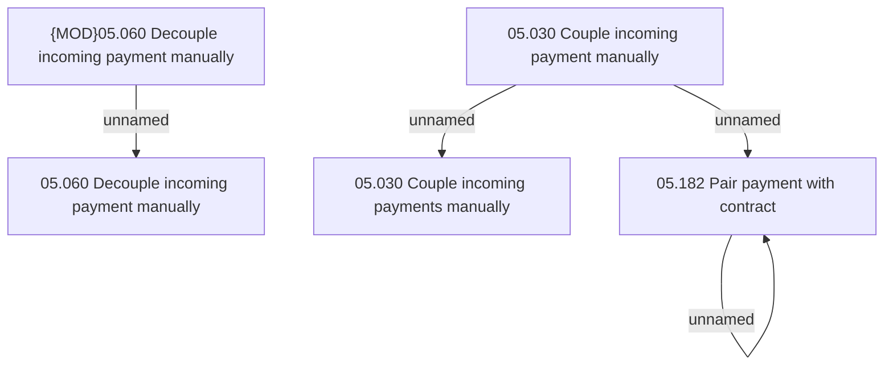

# Access Rights

- **Diagram Type**: Custom
- **Package**: HomerSelect/BSL/Modules/Incoming Payments/Analytical Model/Pairing incoming payments/Access Rights
- **Diagram ID**: 143081
- **Elements**: 6
- **Connectors**: 4

