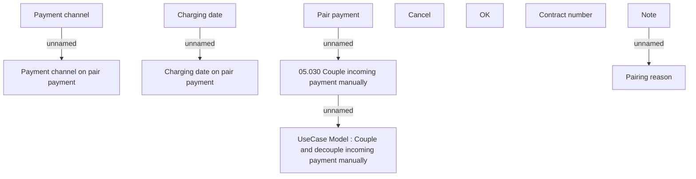

# Couple incoming payment manually - UI

```mermaid
graph TD
    Payment_channel_on_pair_payment["Payment channel on pair payment"]
    Charging_date_on_pair_payment["Charging date on pair payment"]
    el_1673335["Note"]
    n_05_030_Couple_incoming_payment_manually["05.030 Couple incoming payment manually"]
    UseCase_Model_Couple_and_decouple_incoming_payment_manually["UseCase Model : Couple and decouple incoming payment manually"]
    Pairing_reason["Pairing reason"]
    Charging_date["Charging date"]
    Payment_channel["Payment channel"]
    Cancel["Cancel"]
    OK["OK"]
    Contract_number["Contract number"]
    Pair_payment["Pair payment"]
    Payment_channel -->|unnamed| Payment_channel_on_pair_payment
    Charging_date -->|unnamed| Charging_date_on_pair_payment
    el_1673335 -->|unnamed| Pairing_reason
    Pair_payment -->|unnamed| n_05_030_Couple_incoming_payment_manually
    n_05_030_Couple_incoming_payment_manually -->|unnamed| UseCase_Model_Couple_and_decouple_incoming_payment_manually
```
