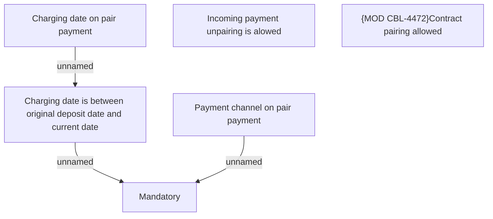

# Validation Rules

- **Diagram Type**: Custom
- **Package**: HomerSelect/BSL/Modules/Incoming Payments/Analytical Model/Pairing incoming payments/Validation Rules
- **Diagram ID**: 143086
- **Elements**: 6
- **Connectors**: 3

