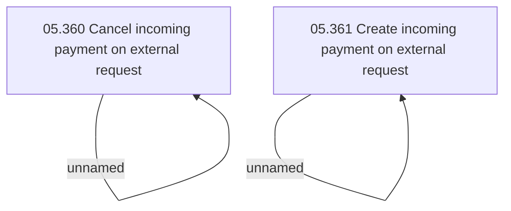

# Access Rights

- **Diagram Type**: Custom
- **Package**: HomerSelect/BSL/Modules/Incoming Payments/Analytical Model/Process external request on incoming payment/Access Rights
- **Diagram ID**: 143087
- **Elements**: 4
- **Connectors**: 2

