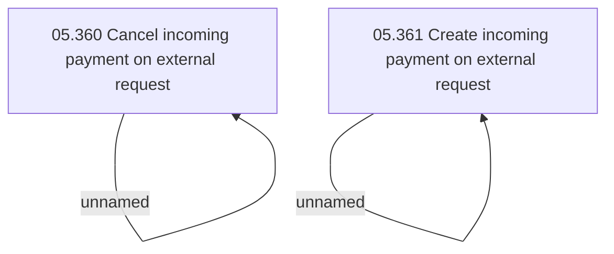

# Access Rights

```mermaid
graph TD
    n_05_360_Cancel_incoming_payment_on_external_request["05.360 Cancel incoming payment on external request"]
    n_05_361_Create_incoming_payment_on_external_request["05.361 Create incoming payment on external request"]
    n_05_360_Cancel_incoming_payment_on_external_request["05.360 Cancel incoming payment on external request"]
    n_05_361_Create_incoming_payment_on_external_request["05.361 Create incoming payment on external request"]
    n_05_361_Create_incoming_payment_on_external_request -->|unnamed| n_05_361_Create_incoming_payment_on_external_request
    n_05_360_Cancel_incoming_payment_on_external_request -->|unnamed| n_05_360_Cancel_incoming_payment_on_external_request
```
