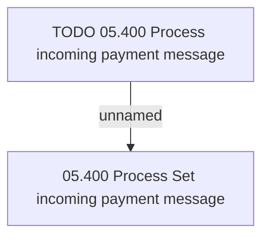

# Access Rights

- **Diagram Type**: Custom
- **Package**: HomerSelect/BSL/Modules/Incoming Payments/Analytical Model/Process incoming payment message/Access Right
- **Diagram ID**: 143090
- **Elements**: 2
- **Connectors**: 1

