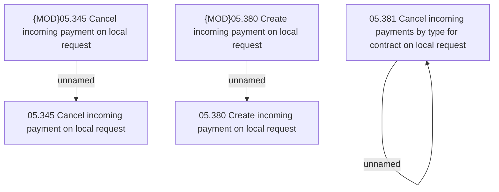

# Access Rights

```mermaid
graph TD
    n_05_381_Cancel_incoming_payments_by_type_for_contract_on_lo["05.381 Cancel incoming payments by type for contract on local request"]
    n_05_381_Cancel_incoming_payments_by_type_for_contract_on_lo["05.381 Cancel incoming payments by type for contract on local request"]
    MOD_05_345_Cancel_incoming_payment_on_local_request["{MOD}05.345 Cancel incoming payment on local request"]
    MOD_05_380_Create_incoming_payment_on_local_request["{MOD}05.380 Create incoming payment on local request"]
    n_05_345_Cancel_incoming_payment_on_local_request["05.345 Cancel incoming payment on local request"]
    n_05_380_Create_incoming_payment_on_local_request["05.380 Create incoming payment on local request"]
    MOD_05_345_Cancel_incoming_payment_on_local_request -->|unnamed| n_05_345_Cancel_incoming_payment_on_local_request
    n_05_381_Cancel_incoming_payments_by_type_for_contract_on_lo -->|unnamed| n_05_381_Cancel_incoming_payments_by_type_for_contract_on_lo
    MOD_05_380_Create_incoming_payment_on_local_request -->|unnamed| n_05_380_Create_incoming_payment_on_local_request
```
