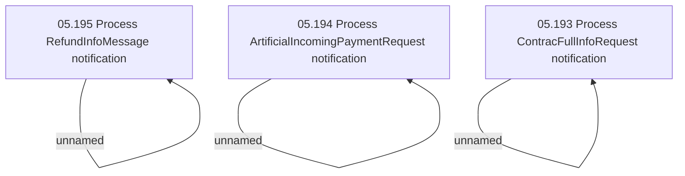

# Access Rights

```mermaid
graph TD
    n_05_195_Process_RefundInfoMessage_notification["05.195 Process RefundInfoMessage notification"]
    n_05_195_Process_RefundInfoMessage_notification["05.195 Process RefundInfoMessage notification"]
    n_05_194_Process_ArtificialIncomingPaymentRequest_notificati["05.194 Process ArtificialIncomingPaymentRequest notification"]
    n_05_194_Process_ArtificialIncomingPaymentRequest_notificati["05.194 Process ArtificialIncomingPaymentRequest notification"]
    n_05_193_Process_ContracFullInfoRequest_notification["05.193 Process ContracFullInfoRequest notification"]
    n_05_193_Process_ContracFullInfoRequest_notification["05.193 Process ContracFullInfoRequest notification"]
    n_05_193_Process_ContracFullInfoRequest_notification -->|unnamed| n_05_193_Process_ContracFullInfoRequest_notification
    n_05_194_Process_ArtificialIncomingPaymentRequest_notificati -->|unnamed| n_05_194_Process_ArtificialIncomingPaymentRequest_notificati
    n_05_195_Process_RefundInfoMessage_notification -->|unnamed| n_05_195_Process_RefundInfoMessage_notification
```
