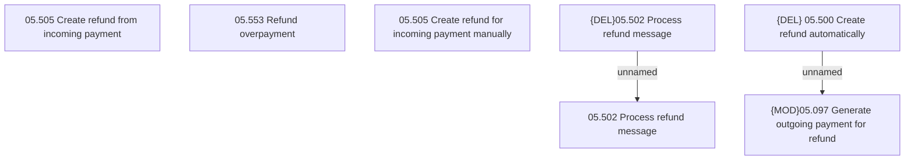

# Access Rights

- **Diagram Type**: Custom
- **Package**: HomerSelect/BSL/Modules/Incoming Payments/Analytical Model/Refunds/Access Rights
- **Diagram ID**: 164245
- **Elements**: 9
- **Connectors**: 2

