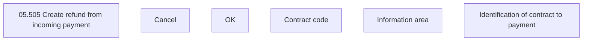

# Identification of contract to payment

- **Diagram Type**: Custom
- **Package**: HomerSelect/BSL/Modules/Incoming Payments/Analytical Model/Refunds/User Interface Model
- **Diagram ID**: 162878
- **Elements**: 6
- **Connectors**: 0

