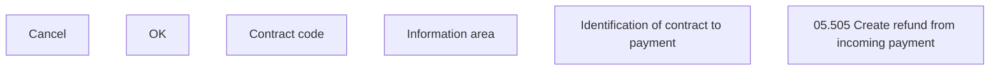

# Identification of contract to payment

```mermaid
graph TD
    Cancel["Cancel"]
    OK["OK"]
    Contract_code["Contract code"]
    Information_area["Information area"]
    Identification_of_contract_to_payment["Identification of contract to payment"]
    n_05_505_Create_refund_from_incoming_payment["05.505 Create refund from incoming payment"]
```
