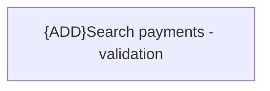

# Validation Rules

- **Diagram Type**: Custom
- **Package**: HomerSelect/BSL/Modules/Incoming Payments/Interface provided/Provided REST API/Validation Rules
- **Diagram ID**: 163720
- **Elements**: 1
- **Connectors**: 0

