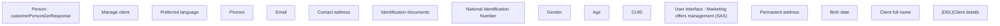

# Client Details

```mermaid
graph TD
    Person_customerPersonGetResponse["Person : customerPersonGetResponse"]
    Manage_client["Manage client"]
    Preferred_language["Preferred language"]
    Phones["Phones"]
    Email["Email"]
    Contact_address["Contact address"]
    Identification_documents["Identification documents"]
    National_Identification_Number["National Identification Number"]
    Gender["Gender"]
    Age["Age"]
    CUID["CUID"]
    User_Interface_Marketing_offers_management_SAS["User Interface : Marketing offers management (SAS)"]
    Permanent_address["Permanent address"]
    Birth_date["Birth date"]
    Client_full_name["Client full name"]
    DEL_Client_details["{DEL}Client details"]
```
