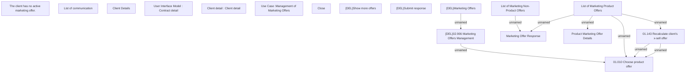

# Marketing offers management (SAS)

```mermaid
graph TD
    The_client_has_no_active_marketing_offer["The client has no active marketing offer."]
    n_01_143_Recalculate_client_s_x_sell_offer["01.143 Recalculate client's x-sell offer"]
    List_of_communication["List of communication"]
    Marketing_Offer_Response["Marketing Offer Response"]
    Product_Marketing_Offer_Details["Product Marketing Offer Details"]
    Client_Details["Client Details"]
    n_01_010_Choose_product_offer["01.010 Choose product offer"]
    User_Interface_Model_Contract_detail["User Interface Model : Contract detail"]
    Client_detail_Client_detail["Client detail : Client detail"]
    Use_Case_Management_of_Marketing_Offers["Use Case :Management of Marketing Offers"]
    Close["Close"]
    DEL_02_906_Marketing_Offers_Management["{DEL}02.906 Marketing Offers Management"]
    DEL_Show_more_offers["{DEL}Show more offers"]
    DEL_Submit_response["{DEL}Submit response"]
    List_of_Marketing_Non_Product_Offers["List of Marketing Non-Product Offers"]
    List_of_Marketing_Product_Offers["List of Marketing Product Offers"]
    DEL_Marketing_Offers["{DEL}Marketing Offers"]
    DEL_Marketing_Offers -->|unnamed| DEL_02_906_Marketing_Offers_Management
    DEL_02_906_Marketing_Offers_Management -->|unnamed| n_01_010_Choose_product_offer
    List_of_Marketing_Product_Offers -->|unnamed| n_01_010_Choose_product_offer
    List_of_Marketing_Product_Offers -->|unnamed| Product_Marketing_Offer_Details
    List_of_Marketing_Non_Product_Offers -->|unnamed| Marketing_Offer_Response
    List_of_Marketing_Product_Offers -->|unnamed| Marketing_Offer_Response
    List_of_Marketing_Product_Offers -->|unnamed| n_01_143_Recalculate_client_s_x_sell_offer
    n_01_143_Recalculate_client_s_x_sell_offer -->|unnamed| n_01_010_Choose_product_offer
    n_01_143_Recalculate_client_s_x_sell_offer -->|unnamed| n_01_010_Choose_product_offer
```
