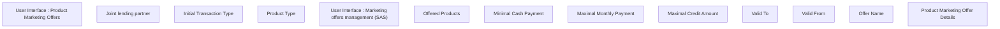

# Product Marketing Offer Details

```mermaid
graph TD
    User_Interface_Product_Marketing_Offers["User Interface : Product Marketing Offers"]
    Joint_lending_partner["Joint lending partner"]
    Initial_Transaction_Type["Initial Transaction Type"]
    Product_Type["Product Type"]
    User_Interface_Marketing_offers_management_SAS["User Interface : Marketing offers management (SAS)"]
    Offered_Products["Offered Products"]
    Minimal_Cash_Payment["Minimal Cash Payment"]
    Maximal_Monthly_Payment["Maximal Monthly Payment"]
    Maximal_Credit_Amount["Maximal Credit Amount"]
    Valid_To["Valid To"]
    Valid_From["Valid From"]
    Offer_Name["Offer Name"]
    Product_Marketing_Offer_Details["Product Marketing Offer Details"]
```
