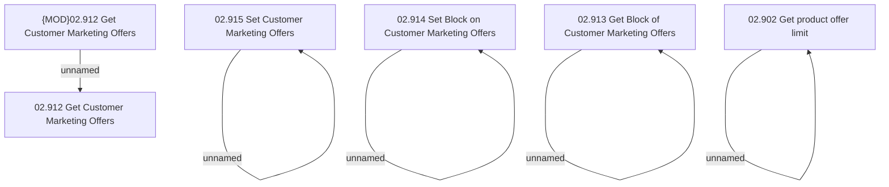

# Access Rights

- **Diagram Type**: Custom
- **Package**: HomerSelect/BSL/Modules/Marketing Offer/Analytical Model/Marketing Offers Data Source/Marketing Offers Data Source (common)/Access Rights
- **Diagram ID**: 104431
- **Elements**: 10
- **Connectors**: 5

