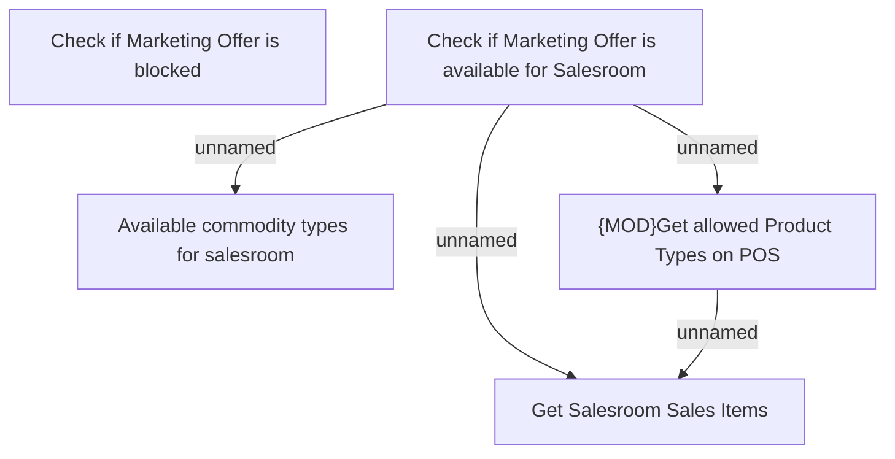

# Business Rules - Provide Product Offer Limits

- **Diagram Type**: Custom
- **Package**: HomerSelect/BSL/Modules/Marketing Offer/Analytical Model/Marketing Offers Data Source/Marketing Offers Data Source (common)/Business Rules
- **Diagram ID**: 124998
- **Elements**: 5
- **Connectors**: 4

