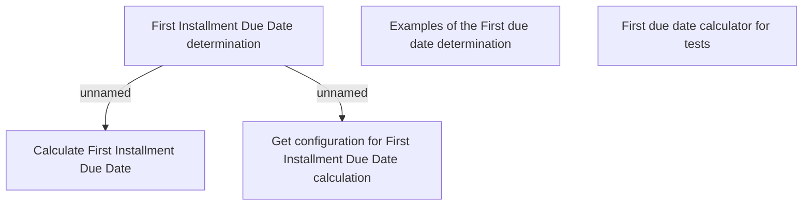

# CEL Installment Schedule Dates determination

- **Diagram Type**: Custom
- **Package**: HomerSelect/BSL/Modules/Product Calculator/Analytical Model/Installment Schedule Dates/CEL/Business rules
- **Diagram ID**: 128990
- **Elements**: 5
- **Connectors**: 2

