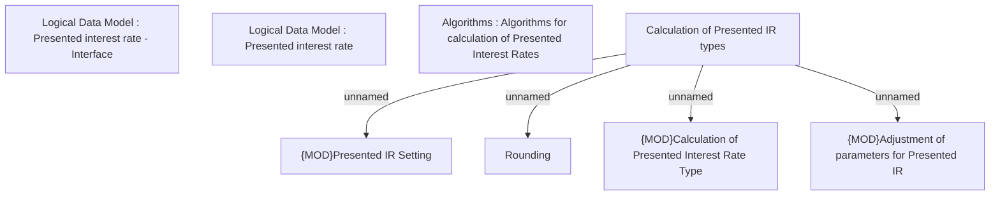

# Evaluation of Presented interest rates

```mermaid
graph TD
    Logical_Data_Model_Presented_interest_rate_Interface["Logical Data Model : Presented interest rate - Interface"]
    MOD_Adjustment_of_parameters_for_Presented_IR["{MOD}Adjustment of parameters for Presented IR"]
    Logical_Data_Model_Presented_interest_rate["Logical Data Model : Presented interest rate"]
    MOD_Calculation_of_Presented_Interest_Rate_Type["{MOD}Calculation of Presented Interest Rate Type"]
    Rounding["Rounding"]
    Algorithms_Algorithms_for_calculation_of_Presented_Interest_["Algorithms : Algorithms for calculation of Presented Interest Rates"]
    Calculation_of_Presented_IR_types["Calculation of Presented IR types"]
    MOD_Presented_IR_Setting["{MOD}Presented IR Setting"]
    Calculation_of_Presented_IR_types -->|unnamed| MOD_Presented_IR_Setting
    Calculation_of_Presented_IR_types -->|unnamed| Rounding
    Calculation_of_Presented_IR_types -->|unnamed| MOD_Calculation_of_Presented_Interest_Rate_Type
    Calculation_of_Presented_IR_types -->|unnamed| MOD_Adjustment_of_parameters_for_Presented_IR
```
