# Algorithms for calculation of Presented Interest Rates

- **Diagram Type**: Custom
- **Package**: HomerSelect/BSL/Modules/Product Calculator/Analytical Model/Presented Interest Rates/Business Rules/Algorithms
- **Diagram ID**: 164323
- **Elements**: 24
- **Connectors**: 25

```mermaid
graph TD
    ADD_Calculation_of_Nominal_XIRR_XIRR_N["{ADD}Calculation of Nominal XIRR (XIRR_N)"]
    ADD_Calculation_customer_effective_interest_rate_recalculate["{ADD}Calculation customer effective interest rate recalculated for simple interest (APR_Y)"]
    Calculation_of_Monthly_interest_rate_from_Product_AIR_M["Calculation of Monthly interest rate from Product (AIR_M)"]
    R365_Y_algorithm["R365_Y algorithm"]
    Calculation_of_Presented_IRR_per_month_extended_IRREXT_M["Calculation of Presented IRR per month extended (IRREXT_M) "]
    Logical_Data_Model_Presented_interest_rate_Interface["Logical Data Model :Presented interest rate - Interface"]
    Calculate_number_of_days_for_30_360_day_count_convention["Calculate number of days for 30/360 day count convention"]
    EIR_calculation["EIR calculation"]
    Business_Rules_Evaluation_of_Presented_interest_rates["Business Rules : Evaluation of Presented interest rates"]
    XIRR_algorithm["XIRR algorithm"]
    XIREL_calculation_XIREL_calculation["XIREL calculation : XIREL calculation"]
    Calculation_of_IRR_per_Year_for_REL_initial_and_extra_transa["Calculation of IRR per Year for REL - initial and extra transaction (XIREL2)"]
    Calculation_of_IRR_per_Year_for_REL_initial_transaction_only["Calculation of IRR per Year for REL - initial transaction only (XIREL1)"]
    Calculation_of_Effective_interest_rate_per_Month_EIR_M["Calculation of Effective interest rate per Month (EIR_M)"]
    Calculation_of_Effective_interest_rate_per_Year_EIR_Y["Calculation of Effective interest rate per Year (EIR_Y)"]
    Calculation_of_Flat_Rate_per_month_CFR_M["Calculation of Flat Rate per month (CFR_M)"]
    Calculation_of_XIRR_XIRR["Calculation of XIRR (XIRR) "]
    MOD_Calculation_of_Presented_Interest_Rate_Type["{MOD}Calculation of Presented Interest Rate Type"]
    Calculation_of_Annual_interest_rate_from_Product_definition_["Calculation of Annual interest rate from Product definition (AIR_P) "]
    Presented_Interest_Rates_Presented_interest_rate_Setting["Presented Interest Rates :Presented interest rate - Setting"]
    Internal_Rate_of_Return_calculation["Internal Rate of Return calculation"]
    Calculation_of_interest_rate_derived_from_ACT_365_per_year_R["Calculation of interest rate derived from ACT/365 per year (R365_Y) "]
    Calculation_of_Flat_Rate_per_year_CFR_Y["Calculation of Flat Rate per year (CFR_Y)"]
    Calculation_of_Presented_IRR_per_month_IRR_M["Calculation of Presented IRR per month (IRR_M) "]
    ADD_Calculation_customer_effective_interest_rate_recalculate -->|unnamed| MOD_Calculation_of_Presented_Interest_Rate_Type
    Calculation_of_Presented_IRR_per_month_extended_IRREXT_M -->|unnamed| Calculate_number_of_days_for_30_360_day_count_convention
    Calculation_of_Effective_interest_rate_per_Month_EIR_M -->|unnamed| EIR_calculation
    Calculation_of_XIRR_XIRR -->|unnamed| XIRR_algorithm
    Calculation_of_IRR_per_Year_for_REL_initial_transaction_only -->|unnamed| XIREL_calculation_XIREL_calculation
    Calculation_of_IRR_per_Year_for_REL_initial_and_extra_transa -->|unnamed| XIREL_calculation_XIREL_calculation
    Calculation_of_Effective_interest_rate_per_Year_EIR_Y -->|unnamed| Calculation_of_Effective_interest_rate_per_Month_EIR_M
    ADD_Calculation_of_Nominal_XIRR_XIRR_N -->|unnamed| Calculation_of_XIRR_XIRR
    Calculation_of_Presented_IRR_per_month_extended_IRREXT_M -->|unnamed| MOD_Calculation_of_Presented_Interest_Rate_Type
    Calculation_of_IRR_per_Year_for_REL_initial_and_extra_transa -->|unnamed| MOD_Calculation_of_Presented_Interest_Rate_Type
    Calculation_of_Monthly_interest_rate_from_Product_AIR_M -->|unnamed| MOD_Calculation_of_Presented_Interest_Rate_Type
    Calculation_of_interest_rate_derived_from_ACT_365_per_year_R -->|unnamed| R365_Y_algorithm
    Calculation_of_Effective_interest_rate_per_Month_EIR_M -->|unnamed| MOD_Calculation_of_Presented_Interest_Rate_Type
    Calculation_of_Flat_Rate_per_month_CFR_M -->|unnamed| Calculation_of_Flat_Rate_per_year_CFR_Y
    Calculation_of_Effective_interest_rate_per_Year_EIR_Y -->|unnamed| MOD_Calculation_of_Presented_Interest_Rate_Type
    Calculation_of_Flat_Rate_per_month_CFR_M -->|unnamed| MOD_Calculation_of_Presented_Interest_Rate_Type
    Calculation_of_XIRR_XIRR -->|unnamed| MOD_Calculation_of_Presented_Interest_Rate_Type
    Calculation_of_Annual_interest_rate_from_Product_definition_ -->|unnamed| MOD_Calculation_of_Presented_Interest_Rate_Type
    Calculation_of_interest_rate_derived_from_ACT_365_per_year_R -->|unnamed| MOD_Calculation_of_Presented_Interest_Rate_Type
    Calculation_of_Flat_Rate_per_year_CFR_Y -->|unnamed| MOD_Calculation_of_Presented_Interest_Rate_Type
    Calculation_of_Presented_IRR_per_month_IRR_M -->|unnamed| MOD_Calculation_of_Presented_Interest_Rate_Type
    ADD_Calculation_of_Nominal_XIRR_XIRR_N -->|unnamed| MOD_Calculation_of_Presented_Interest_Rate_Type
    Calculation_of_Presented_IRR_per_month_extended_IRREXT_M -->|unnamed| Internal_Rate_of_Return_calculation
    Calculation_of_Presented_IRR_per_month_IRR_M -->|unnamed| Internal_Rate_of_Return_calculation
    Calculation_of_IRR_per_Year_for_REL_initial_transaction_only -->|unnamed| MOD_Calculation_of_Presented_Interest_Rate_Type
```

