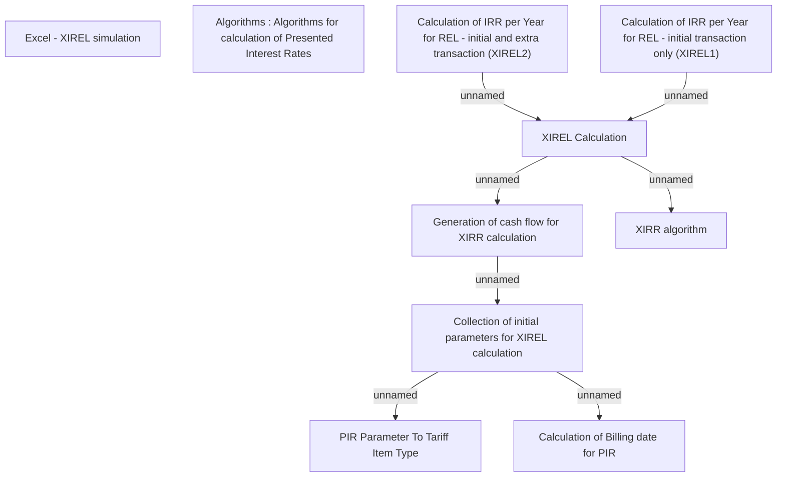

# XIREL calculation

- **Diagram Type**: Custom
- **Package**: HomerSelect/BSL/Modules/Product Calculator/Analytical Model/Presented Interest Rates/Business Rules/Algorithms/XIREL calculation
- **Diagram ID**: 89791
- **Elements**: 10
- **Connectors**: 7

