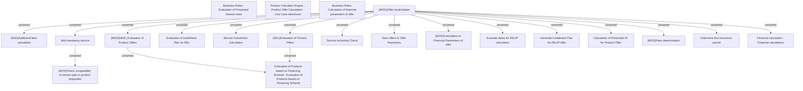

# Offer recalculation

```mermaid
graph TD
    ADD_Additional_fees_calculation["{ADD}Additional fees calculation"]
    MOD_Check_compatibility_of_service_type_to_product_propertie["{MOD}Check compatibility of service type to product properties"]
    Add_mandatory_service["Add mandatory service"]
    MOD_NEW_Evaluation_of_Product_Offers["{MOD}NEW_Evaluation of Product Offers"]
    Evaluation_of_Installment_Plan_for_REL["Evaluation of Installment Plan for REL"]
    Business_Rules_Evaluation_of_Presented_interest_rates["Business Rules : Evaluation of Presented interest rates"]
    Service_Subvention_Calculation["Service Subvention Calculation"]
    Evaluation_of_Products_based_on_Financing_Scheme_Evaluation_["Evaluation of Products based on Financing Scheme : Evaluation of Products based on Financing Scheme"]
    DEL_Evaluation_of_Product_Offers["{DEL}Evaluation of Product Offers"]
    Service_Inclusivity_Check["Service Inclusivity Check"]
    Save_offers_to_Offer_Repository["Save offers to Offer Repository"]
    Product_Calculator_Engine_Product_Offer_Calculation_Use_Case["Product Calculator Engine : Product Offer Calculation - Use Case references"]
    Business_Rules_Calculation_of_financial_parameters_of_offer["Business Rules :Calculation of financial parameters of offer"]
    MOD_Calculation_of_Financial_Parameters_of_offer["{MOD}Calculation of Financial Parameters of offer"]
    Evaluate_dates_for_RELIP_calculation["Evaluate dates for RELIP calculation"]
    Generate_Installment_Plan_for_RELIP_offer["Generate Installment Plan for RELIP offer"]
    Calculation_of_Presented_IR_for_Product_Offer["Calculation of Presented IR for Product Offer"]
    MOD_Fees_determination["{MOD}Fees determination"]
    Determine_first_insurance_period["Determine first insurance period"]
    Financial_calculation_Financial_calculations["Financial calculation : Financial calculations"]
    MOD_Offer_recalculation["{MOD}Offer recalculation"]
    MOD_Offer_recalculation -->|unnamed| Save_offers_to_Offer_Repository
    Add_mandatory_service -->|unnamed| MOD_Check_compatibility_of_service_type_to_product_propertie
    MOD_Offer_recalculation -->|unnamed| Add_mandatory_service
    MOD_Offer_recalculation -->|unnamed| MOD_NEW_Evaluation_of_Product_Offers
    MOD_Offer_recalculation -->|unnamed| Evaluation_of_Installment_Plan_for_REL
    MOD_Offer_recalculation -->|unnamed| Service_Subvention_Calculation
    MOD_NEW_Evaluation_of_Product_Offers -->|unnamed| Evaluation_of_Products_based_on_Financing_Scheme_Evaluation_
    DEL_Evaluation_of_Product_Offers -->|unnamed| Evaluation_of_Products_based_on_Financing_Scheme_Evaluation_
    MOD_Offer_recalculation -->|unnamed| ADD_Additional_fees_calculation
    MOD_Offer_recalculation -->|unnamed| Service_Inclusivity_Check
    MOD_Offer_recalculation -->|unnamed| Financial_calculation_Financial_calculations
    MOD_Offer_recalculation -->|unnamed| MOD_Calculation_of_Financial_Parameters_of_offer
    MOD_Offer_recalculation -->|unnamed| Evaluate_dates_for_RELIP_calculation
    MOD_Offer_recalculation -->|unnamed| Generate_Installment_Plan_for_RELIP_offer
    MOD_Offer_recalculation -->|unnamed| Calculation_of_Presented_IR_for_Product_Offer
    MOD_Offer_recalculation -->|unnamed| MOD_Fees_determination
    MOD_Offer_recalculation -->|unnamed| Determine_first_insurance_period
    MOD_Offer_recalculation -->|unnamed| DEL_Evaluation_of_Product_Offers
```
