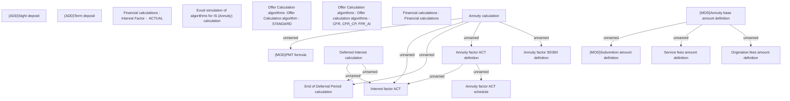

# Annuity calculations

```mermaid
graph TD
    ADD_Sight_deposit["{ADD}Sight deposit"]
    ADD_Term_deposit["{ADD}Term deposit"]
    MOD_PMT_formula["{MOD}PMT formula"]
    Financial_calculations_Interest_Factor_ACTUAL["Financial calculations : Interest Factor -  ACTUAL"]
    Interest_factor_ACT["Interest factor ACT"]
    End_of_Deferred_Period_calculation["End of Deferred Period calculation"]
    Excel_simulation_of_algorithms_for_IS_Annuity_calculation["Excel simulation of algorithms for IS (Annuity) calculation"]
    Deferred_Interest_calculation["Deferred Interest calculation"]
    Annuity_factor_ACT_schedule["Annuity factor ACT schedule"]
    Offer_Calculation_algorithms_Offer_Calculation_algorithm_STA["Offer Calculation algorithms :Offer Calculation algorithm - STANDARD"]
    Offer_Calculation_algorithms_Offer_calculation_algorithms_CF["Offer Calculation algorithms : Offer calculation algorithms - CFR, CFR_CP, FFR_AI"]
    Financial_calculations_Financial_calculations["Financial calculations : Financial calculations"]
    Annuity_factor_ACT_definition["Annuity factor ACT definition"]
    MOD_Subvention_amount_definition["{MOD}Subvention amount definition"]
    Annuity_calculation["Annuity calculation"]
    Annuity_factor_30_360_definition["Annuity factor 30/360 definition"]
    Service_fees_amount_definition["Service fees amount definition"]
    Origination_fees_amount_definition["Origination fees amount definition"]
    MOD_Annuity_base_amount_definition["{MOD}Annuity base amount definition"]
    MOD_Annuity_base_amount_definition -->|unnamed| Origination_fees_amount_definition
    MOD_Annuity_base_amount_definition -->|unnamed| Service_fees_amount_definition
    Annuity_calculation -->|unnamed| Annuity_factor_30_360_definition
    MOD_Annuity_base_amount_definition -->|unnamed| MOD_Subvention_amount_definition
    Annuity_calculation -->|unnamed| Annuity_factor_ACT_definition
    Annuity_factor_ACT_definition -->|unnamed| Annuity_factor_ACT_schedule
    Annuity_calculation -->|unnamed| End_of_Deferred_Period_calculation
    Deferred_Interest_calculation -->|unnamed| End_of_Deferred_Period_calculation
    Annuity_calculation -->|unnamed| Interest_factor_ACT
    Deferred_Interest_calculation -->|unnamed| Interest_factor_ACT
    Annuity_factor_ACT_definition -->|unnamed| Interest_factor_ACT
    Annuity_calculation -->|unnamed| MOD_PMT_formula
```
