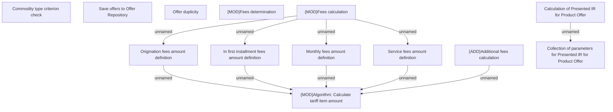

# Calculate Product Offer - Auxiliary evaluations

```mermaid
graph TD
    MOD_Algorithm_Calculate_tariff_item_amount["{MOD}Algorithm: Calculate tariff item amount"]
    ADD_Additional_fees_calculation["{ADD}Additional fees calculation"]
    Service_fees_amount_definition["Service fees amount definition"]
    Origination_fees_amount_definition["Origination fees amount definition"]
    Monthly_fees_amount_definition["Monthly fees amount definition"]
    In_first_installment_fees_amount_definition["In first installment fees amount definition"]
    Commodity_type_criterion_check["Commodity type criterion check"]
    Save_offers_to_Offer_Repository["Save offers to Offer Repository"]
    Offer_duplicity["Offer duplicity"]
    MOD_Fees_determination["{MOD}Fees determination"]
    MOD_Fees_calculation["{MOD}Fees calculation"]
    Collection_of_parameters_for_Presented_IR_for_Product_Offer["Collection of parameters for Presented IR for Product Offer"]
    Calculation_of_Presented_IR_for_Product_Offer["Calculation of Presented IR for Product Offer"]
    Calculation_of_Presented_IR_for_Product_Offer -->|unnamed| Collection_of_parameters_for_Presented_IR_for_Product_Offer
    MOD_Fees_calculation -->|unnamed| In_first_installment_fees_amount_definition
    MOD_Fees_calculation -->|unnamed| Monthly_fees_amount_definition
    MOD_Fees_calculation -->|unnamed| Origination_fees_amount_definition
    MOD_Fees_calculation -->|unnamed| Service_fees_amount_definition
    Origination_fees_amount_definition -->|unnamed| MOD_Algorithm_Calculate_tariff_item_amount
    In_first_installment_fees_amount_definition -->|unnamed| MOD_Algorithm_Calculate_tariff_item_amount
    Monthly_fees_amount_definition -->|unnamed| MOD_Algorithm_Calculate_tariff_item_amount
    Service_fees_amount_definition -->|unnamed| MOD_Algorithm_Calculate_tariff_item_amount
    ADD_Additional_fees_calculation -->|unnamed| MOD_Algorithm_Calculate_tariff_item_amount
```
