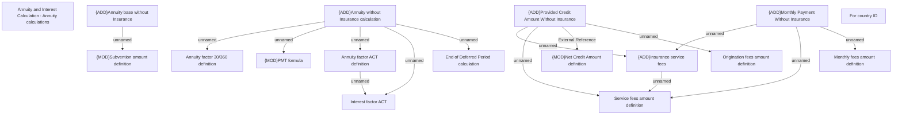

# Financial calculations without insurance

```mermaid
graph TD
    MOD_Subvention_amount_definition["{MOD}Subvention amount definition"]
    MOD_PMT_formula["{MOD}PMT formula"]
    Annuity_factor_ACT_definition["Annuity factor ACT definition"]
    End_of_Deferred_Period_calculation["End of Deferred Period calculation"]
    Annuity_factor_30_360_definition["Annuity factor 30/360 definition"]
    Interest_factor_ACT["Interest factor ACT"]
    MOD_Net_Credit_Amount_definition["{MOD}Net Credit Amount definition"]
    Monthly_fees_amount_definition["Monthly fees amount definition"]
    Annuity_and_Interest_Calculation_Annuity_calculations["Annuity and Interest Calculation : Annuity calculations"]
    ADD_Annuity_without_Insurance_calculation["{ADD}Annuity without Insurance calculation"]
    ADD_Annuity_base_without_Insurance["{ADD}Annuity base without Insurance"]
    Service_fees_amount_definition["Service fees amount definition"]
    Origination_fees_amount_definition["Origination fees amount definition"]
    ADD_Monthly_Payment_Without_Insurance["{ADD}Monthly Payment Without Insurance"]
    ADD_Insurance_service_fees["{ADD}Insurance service fees"]
    ADD_Provided_Credit_Amount_Without_Insurance["{ADD}Provided Credit Amount Without Insurance"]
    For_country_ID["For country ID"]
    ADD_Provided_Credit_Amount_Without_Insurance -->|unnamed| ADD_Insurance_service_fees
    ADD_Provided_Credit_Amount_Without_Insurance -->|unnamed| Service_fees_amount_definition
    ADD_Provided_Credit_Amount_Without_Insurance -->|External Reference| MOD_Net_Credit_Amount_definition
    ADD_Provided_Credit_Amount_Without_Insurance -->|unnamed| Origination_fees_amount_definition
    ADD_Insurance_service_fees -->|unnamed| Service_fees_amount_definition
    ADD_Monthly_Payment_Without_Insurance -->|unnamed| ADD_Insurance_service_fees
    ADD_Monthly_Payment_Without_Insurance -->|unnamed| Service_fees_amount_definition
    ADD_Monthly_Payment_Without_Insurance -->|unnamed| Monthly_fees_amount_definition
    ADD_Annuity_base_without_Insurance -->|unnamed| MOD_Subvention_amount_definition
    ADD_Annuity_without_Insurance_calculation -->|unnamed| Annuity_factor_30_360_definition
    ADD_Annuity_without_Insurance_calculation -->|unnamed| MOD_PMT_formula
    ADD_Annuity_without_Insurance_calculation -->|unnamed| Annuity_factor_ACT_definition
    ADD_Annuity_without_Insurance_calculation -->|unnamed| Interest_factor_ACT
    ADD_Annuity_without_Insurance_calculation -->|unnamed| End_of_Deferred_Period_calculation
    Annuity_factor_ACT_definition -->|unnamed| Interest_factor_ACT
```
