# Financial calculations

- **Diagram Type**: Custom
- **Package**: HomerSelect/BSL/Modules/Product Calculator/Analytical Model/Product Calculator Engine/Business Rules/Auxiliary evaluations/Financial calculations
- **Diagram ID**: 164415
- **Elements**: 34
- **Connectors**: 29

```mermaid
graph TD
    Subvention_Discount_definition["Subvention Discount definition"]
    ADD_First_installment_amount_base_calculation["{ADD}First installment amount base calculation"]
    Basic_Principal_calculation["Basic Principal calculation"]
    Commodity_Net_Principal["Commodity Net Principal"]
    Proportional_Simple_Principal["Proportional Simple Principal"]
    Deferred_Interest["Deferred Interest"]
    Cash_Principal_calculation["Cash Principal calculation"]
    Search_for_Allowed_Base_Types_by_Usage["Search for Allowed Base Types by Usage"]
    In_first_installment_fees_amount_definition["In first installment fees amount definition"]
    MOD_Subsidized_Principal_calculation["{MOD}Subsidized Principal calculation"]
    End_of_Deferred_Period_calculation["End of Deferred Period calculation"]
    Initial_Cash_Payment_definition["Initial Cash Payment definition"]
    Whole_principal_calculation["Whole principal calculation"]
    MOD_Simple_principal_calculation["{MOD}Simple principal calculation"]
    Deferred_Interest_calculation["Deferred Interest calculation"]
    Logical_Data_Model_Product_Offer["Logical Data Model : Product Offer"]
    First_Installment_Amount["First Installment Amount"]
    Provided_Credit_Limit_definition["Provided Credit Limit definition"]
    Net_Credit_Limit_definition["Net Credit Limit definition"]
    Down_payment["Down payment"]
    MOD_Presented_Minimal_Monthly_Installment["{MOD}Presented Minimal Monthly Installment"]
    Total_Payment_Per_Credit["Total Payment Per Credit"]
    Cash_Payment_on_Product["Cash Payment on Product"]
    Calculate_product_offer_Evaluation_of_product_sub_variant["Calculate product offer : Evaluation of product sub-variant"]
    Logical_Data_Model_Contract_Offer["Logical Data Model : Contract - Offer"]
    Service_fees_amount_definition["Service fees amount definition"]
    Cash_payment_definition["Cash payment definition"]
    Credit_amount_definition["Credit amount definition"]
    Provided_Credit_Amount_definition["Provided Credit Amount definition"]
    MOD_Net_Credit_Amount_definition["{MOD}Net Credit Amount definition"]
    Total_Monthly_Payment_definition["Total Monthly Payment definition"]
    Origination_fees_amount_definition["Origination fees amount definition"]
    Monthly_fees_amount_definition["Monthly fees amount definition"]
    Net_Cash_Payment_amount_definition["Net Cash Payment amount definition"]
    Proportional_Simple_Principal -->|unnamed| MOD_Simple_principal_calculation
    Deferred_Interest -->|unnamed| Deferred_Interest_calculation
    MOD_Subsidized_Principal_calculation -->|unnamed| Subvention_Discount_definition
    MOD_Subsidized_Principal_calculation -->|unnamed| Initial_Cash_Payment_definition
    MOD_Simple_principal_calculation -->|unnamed| Subvention_Discount_definition
    Deferred_Interest_calculation -->|unnamed| End_of_Deferred_Period_calculation
    First_Installment_Amount -->|unnamed| Monthly_fees_amount_definition
    First_Installment_Amount -->|unnamed| Deferred_Interest_calculation
    First_Installment_Amount -->|unnamed| In_first_installment_fees_amount_definition
    First_Installment_Amount -->|unnamed| Service_fees_amount_definition
    Provided_Credit_Limit_definition -->|unnamed| Net_Credit_Limit_definition
    Provided_Credit_Limit_definition -->|unnamed| Origination_fees_amount_definition
    Basic_Principal_calculation -->|unnamed| Initial_Cash_Payment_definition
    Down_payment -->|unnamed| Origination_fees_amount_definition
    Net_Cash_Payment_amount_definition -->|unnamed| Service_fees_amount_definition
    Down_payment -->|unnamed| Service_fees_amount_definition
    MOD_Presented_Minimal_Monthly_Installment -->|unnamed| Search_for_Allowed_Base_Types_by_Usage
    Total_Payment_Per_Credit -->|unnamed| Cash_payment_definition
    Total_Payment_Per_Credit -->|unnamed| Total_Monthly_Payment_definition
    Cash_payment_definition -->|unnamed| Origination_fees_amount_definition
    Cash_payment_definition -->|unnamed| Service_fees_amount_definition
    Credit_amount_definition -->|unnamed| Provided_Credit_Amount_definition
    Provided_Credit_Amount_definition -->|unnamed| Service_fees_amount_definition
    Provided_Credit_Amount_definition -->|unnamed| Origination_fees_amount_definition
    Provided_Credit_Amount_definition -->|unnamed| MOD_Net_Credit_Amount_definition
    Total_Monthly_Payment_definition -->|unnamed| Monthly_fees_amount_definition
    Total_Monthly_Payment_definition -->|unnamed| Service_fees_amount_definition
    Net_Cash_Payment_amount_definition -->|unnamed| Origination_fees_amount_definition
    Provided_Credit_Limit_definition -->|unnamed| Service_fees_amount_definition
```

