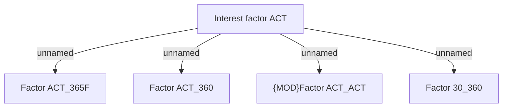

# Interest Factor -  ACTUAL

- **Diagram Type**: Custom
- **Package**: HomerSelect/BSL/Modules/Product Calculator/Analytical Model/Product Calculator Engine/Business Rules/Auxiliary evaluations/Financial calculations/Annuity and Interest Calculation
- **Diagram ID**: 157761
- **Elements**: 5
- **Connectors**: 4

