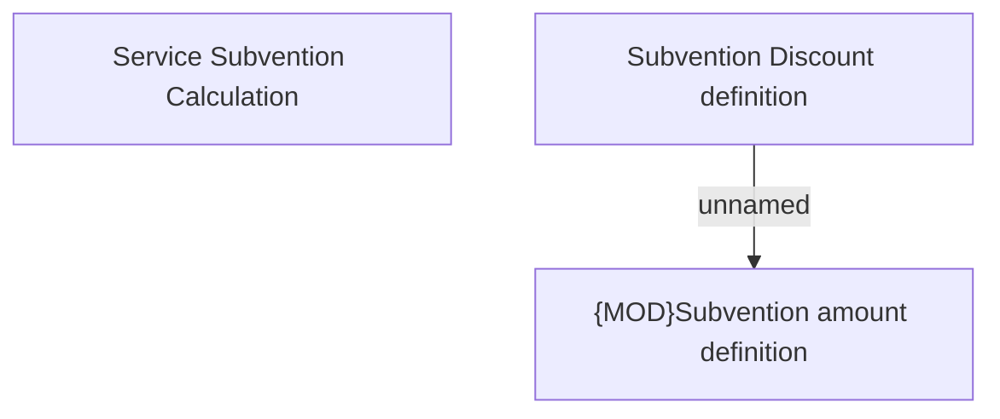

# Subvention calculation

- **Diagram Type**: Custom
- **Package**: HomerSelect/BSL/Modules/Product Calculator/Analytical Model/Product Calculator Engine/Business Rules/Auxiliary evaluations/Financial calculations/Subvention calculation
- **Diagram ID**: 158517
- **Elements**: 3
- **Connectors**: 1

