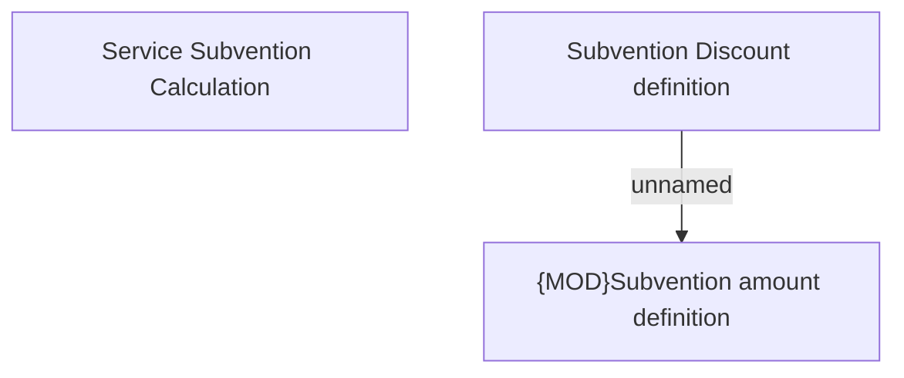

# Subvention calculation

```mermaid
graph TD
    Service_Subvention_Calculation["Service Subvention Calculation"]
    MOD_Subvention_amount_definition["{MOD}Subvention amount definition"]
    Subvention_Discount_definition["Subvention Discount definition"]
    Subvention_Discount_definition -->|unnamed| MOD_Subvention_amount_definition
```
