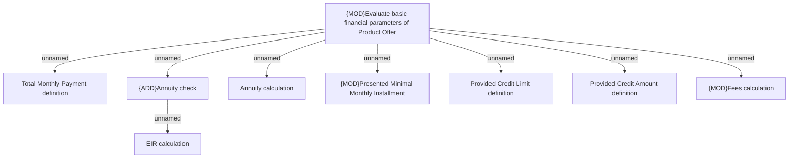

# Evaluation of Basic Financial Parameters of Product Offer

```mermaid
graph TD
    Total_Monthly_Payment_definition["Total Monthly Payment definition"]
    ADD_Annuity_check["{ADD}Annuity check"]
    EIR_calculation["EIR calculation"]
    Annuity_calculation["Annuity calculation"]
    MOD_Presented_Minimal_Monthly_Installment["{MOD}Presented Minimal Monthly Installment"]
    Provided_Credit_Limit_definition["Provided Credit Limit definition"]
    Provided_Credit_Amount_definition["Provided Credit Amount definition"]
    MOD_Fees_calculation["{MOD}Fees calculation"]
    MOD_Evaluate_basic_financial_parameters_of_Product_Offer["{MOD}Evaluate basic financial parameters of Product Offer "]
    MOD_Evaluate_basic_financial_parameters_of_Product_Offer -->|unnamed| MOD_Fees_calculation
    MOD_Evaluate_basic_financial_parameters_of_Product_Offer -->|unnamed| Provided_Credit_Amount_definition
    MOD_Evaluate_basic_financial_parameters_of_Product_Offer -->|unnamed| Provided_Credit_Limit_definition
    MOD_Evaluate_basic_financial_parameters_of_Product_Offer -->|unnamed| MOD_Presented_Minimal_Monthly_Installment
    MOD_Evaluate_basic_financial_parameters_of_Product_Offer -->|unnamed| Annuity_calculation
    ADD_Annuity_check -->|unnamed| EIR_calculation
    MOD_Evaluate_basic_financial_parameters_of_Product_Offer -->|unnamed| ADD_Annuity_check
    MOD_Evaluate_basic_financial_parameters_of_Product_Offer -->|unnamed| Total_Monthly_Payment_definition
```
