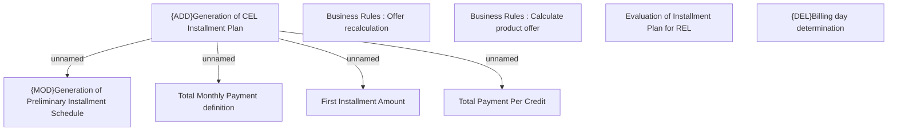

# Evaluation of IP for Product Offer with Financing Scheme

```mermaid
graph TD
    Total_Payment_Per_Credit["Total Payment Per Credit"]
    First_Installment_Amount["First Installment Amount"]
    Total_Monthly_Payment_definition["Total Monthly Payment definition"]
    MOD_Generation_of_Preliminary_Installment_Schedule["{MOD}Generation of Preliminary Installment Schedule"]
    ADD_Generation_of_CEL_Installment_Plan["{ADD}Generation of CEL Installment Plan"]
    Business_Rules_Offer_recalculation["Business Rules : Offer recalculation"]
    Business_Rules_Calculate_product_offer["Business Rules : Calculate product offer"]
    Evaluation_of_Installment_Plan_for_REL["Evaluation of Installment Plan for REL"]
    DEL_Billing_day_determination["{DEL}Billing day determination"]
    ADD_Generation_of_CEL_Installment_Plan -->|unnamed| MOD_Generation_of_Preliminary_Installment_Schedule
    ADD_Generation_of_CEL_Installment_Plan -->|unnamed| Total_Monthly_Payment_definition
    ADD_Generation_of_CEL_Installment_Plan -->|unnamed| First_Installment_Amount
    ADD_Generation_of_CEL_Installment_Plan -->|unnamed| Total_Payment_Per_Credit
```
