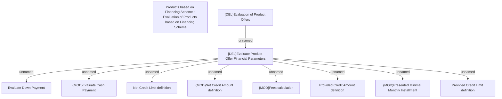

# {DEL}Evaluation of Product Offer Financial Parameters

```mermaid
graph TD
    Provided_Credit_Limit_definition["Provided Credit Limit definition"]
    MOD_Presented_Minimal_Monthly_Installment["{MOD}Presented Minimal Monthly Installment"]
    Provided_Credit_Amount_definition["Provided Credit Amount definition"]
    MOD_Fees_calculation["{MOD}Fees calculation"]
    MOD_Net_Credit_Amount_definition["{MOD}Net Credit Amount definition"]
    Net_Credit_Limit_definition["Net Credit Limit definition"]
    Products_based_on_Financing_Scheme_Evaluation_of_Products_ba["Products based on Financing Scheme : Evaluation of Products based on Financing Scheme"]
    DEL_Evaluate_Product_Offer_Financial_Parameters["{DEL}Evaluate Product Offer Financial Parameters"]
    MOD_Evaluate_Cash_Payment["{MOD}Evaluate Cash Payment"]
    Evaluate_Down_Payment["Evaluate Down Payment"]
    DEL_Evaluation_of_Product_Offers["{DEL}Evaluation of Product Offers"]
    DEL_Evaluate_Product_Offer_Financial_Parameters -->|unnamed| Evaluate_Down_Payment
    DEL_Evaluate_Product_Offer_Financial_Parameters -->|unnamed| MOD_Evaluate_Cash_Payment
    DEL_Evaluate_Product_Offer_Financial_Parameters -->|unnamed| Net_Credit_Limit_definition
    DEL_Evaluate_Product_Offer_Financial_Parameters -->|unnamed| MOD_Net_Credit_Amount_definition
    DEL_Evaluate_Product_Offer_Financial_Parameters -->|unnamed| MOD_Fees_calculation
    DEL_Evaluate_Product_Offer_Financial_Parameters -->|unnamed| Provided_Credit_Amount_definition
    DEL_Evaluate_Product_Offer_Financial_Parameters -->|unnamed| MOD_Presented_Minimal_Monthly_Installment
    DEL_Evaluate_Product_Offer_Financial_Parameters -->|unnamed| Provided_Credit_Limit_definition
    DEL_Evaluation_of_Product_Offers -->|unnamed| DEL_Evaluate_Product_Offer_Financial_Parameters
```
