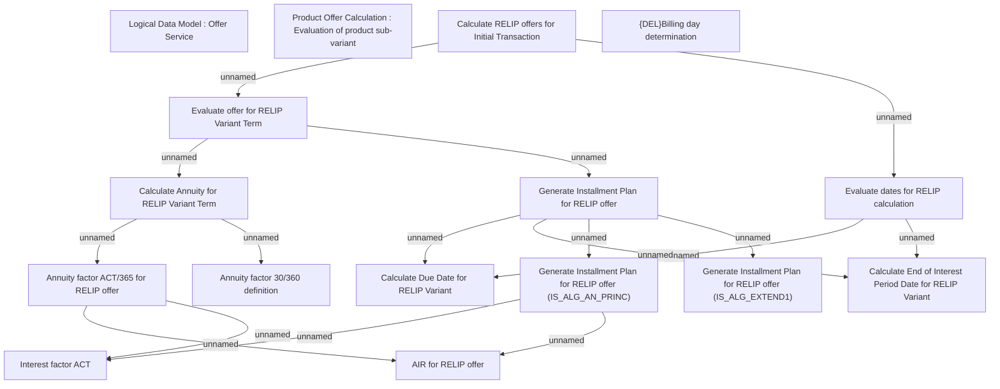

# Calculation of RELIP offers for Initial Transaction

```mermaid
graph TD
    Interest_factor_ACT["Interest factor ACT"]
    Logical_Data_Model_Offer_Service["Logical Data Model : Offer Service"]
    AIR_for_RELIP_offer["AIR for RELIP offer"]
    Annuity_factor_ACT_365_for_RELIP_offer["Annuity factor ACT/365 for RELIP offer"]
    Calculate_Due_Date_for_RELIP_Variant["Calculate Due Date for RELIP Variant"]
    Generate_Installment_Plan_for_RELIP_offer_IS_ALG_EXTEND1["Generate Installment Plan for RELIP offer (IS_ALG_EXTEND1)"]
    Annuity_factor_30_360_definition["Annuity factor 30/360 definition"]
    Calculate_Annuity_for_RELIP_Variant_Term["Calculate Annuity for RELIP Variant Term"]
    Evaluate_dates_for_RELIP_calculation["Evaluate dates for RELIP calculation"]
    Calculate_End_of_Interest_Period_Date_for_RELIP_Variant["Calculate End of Interest Period Date for RELIP Variant "]
    Generate_Installment_Plan_for_RELIP_offer_IS_ALG_AN_PRINC["Generate Installment Plan for RELIP offer (IS_ALG_AN_PRINC)"]
    Generate_Installment_Plan_for_RELIP_offer["Generate Installment Plan for RELIP offer"]
    Product_Offer_Calculation_Evaluation_of_product_sub_variant["Product Offer Calculation : Evaluation of product sub-variant"]
    Evaluate_offer_for_RELIP_Variant_Term["Evaluate offer for RELIP Variant Term"]
    Calculate_RELIP_offers_for_Initial_Transaction["Calculate RELIP offers for Initial Transaction"]
    DEL_Billing_day_determination["{DEL}Billing day determination"]
    Evaluate_offer_for_RELIP_Variant_Term -->|unnamed| Calculate_Annuity_for_RELIP_Variant_Term
    Generate_Installment_Plan_for_RELIP_offer_IS_ALG_AN_PRINC -->|unnamed| Interest_factor_ACT
    Generate_Installment_Plan_for_RELIP_offer_IS_ALG_AN_PRINC -->|unnamed| AIR_for_RELIP_offer
    Annuity_factor_ACT_365_for_RELIP_offer -->|unnamed| AIR_for_RELIP_offer
    Calculate_Annuity_for_RELIP_Variant_Term -->|unnamed| Annuity_factor_ACT_365_for_RELIP_offer
    Evaluate_dates_for_RELIP_calculation -->|unnamed| Calculate_Due_Date_for_RELIP_Variant
    Generate_Installment_Plan_for_RELIP_offer -->|unnamed| Calculate_Due_Date_for_RELIP_Variant
    Annuity_factor_ACT_365_for_RELIP_offer -->|unnamed| Interest_factor_ACT
    Calculate_Annuity_for_RELIP_Variant_Term -->|unnamed| Annuity_factor_30_360_definition
    Calculate_RELIP_offers_for_Initial_Transaction -->|unnamed| Evaluate_offer_for_RELIP_Variant_Term
    Calculate_RELIP_offers_for_Initial_Transaction -->|unnamed| Evaluate_dates_for_RELIP_calculation
    Evaluate_dates_for_RELIP_calculation -->|unnamed| Calculate_End_of_Interest_Period_Date_for_RELIP_Variant
    Generate_Installment_Plan_for_RELIP_offer -->|unnamed| Calculate_End_of_Interest_Period_Date_for_RELIP_Variant
    Generate_Installment_Plan_for_RELIP_offer -->|unnamed| Generate_Installment_Plan_for_RELIP_offer_IS_ALG_AN_PRINC
    Evaluate_offer_for_RELIP_Variant_Term -->|unnamed| Generate_Installment_Plan_for_RELIP_offer
    Generate_Installment_Plan_for_RELIP_offer -->|unnamed| Generate_Installment_Plan_for_RELIP_offer_IS_ALG_EXTEND1
```
