# Calculation of financial parameters of offer

- **Diagram Type**: Custom
- **Package**: HomerSelect/BSL/Modules/Product Calculator/Analytical Model/Product Calculator Engine/Business Rules/Traditional Product without Financing Scheme
- **Diagram ID**: 164310
- **Elements**: 20
- **Connectors**: 14

```mermaid
graph TD
    ADD_Annuity_check["{ADD}Annuity check"]
    Business_Rules_Offer_recalculation["Business Rules : Offer recalculation"]
    Business_Rules_Evaluation_of_product_sub_variant["Business Rules : Evaluation of product sub-variant"]
    MOD_Calculation_of_Financial_Parameters_of_offer["{MOD}Calculation of Financial Parameters of offer"]
    First_Installment_Amount["First Installment Amount"]
    Logical_Data_Model_Product_Offer["Logical Data Model : Product Offer"]
    Offer_Calculation_algorithms_Offer_Calculation_algorithms["Offer Calculation algorithms : Offer Calculation algorithms"]
    MOD_Presented_Minimal_Monthly_Installment["{MOD}Presented Minimal Monthly Installment"]
    Total_Payment_Per_Credit["Total Payment Per Credit"]
    Credit_amount_definition["Credit amount definition"]
    Provided_Credit_Limit_definition["Provided Credit Limit definition"]
    Provided_Credit_Amount_definition["Provided Credit Amount definition"]
    MOD_Net_Credit_Amount_definition["{MOD}Net Credit Amount definition"]
    Net_Cash_Payment_amount_definition["Net Cash Payment amount definition"]
    Net_Credit_Limit_definition["Net Credit Limit definition"]
    Cash_Payment_on_Product["Cash Payment on Product"]
    MOD_Offer_Calculation_Algorithm["{MOD}Offer Calculation Algorithm"]
    MOD_Fees_calculation["{MOD}Fees calculation"]
    Financial_calculation_Financial_calculations["Financial calculation : Financial calculations"]
    Subvention_Discount_definition["Subvention Discount definition"]
    MOD_Calculation_of_Financial_Parameters_of_offer -->|unnamed| MOD_Net_Credit_Amount_definition
    MOD_Calculation_of_Financial_Parameters_of_offer -->|unnamed| First_Installment_Amount
    MOD_Calculation_of_Financial_Parameters_of_offer -->|unnamed| MOD_Presented_Minimal_Monthly_Installment
    MOD_Calculation_of_Financial_Parameters_of_offer -->|unnamed| Total_Payment_Per_Credit
    MOD_Calculation_of_Financial_Parameters_of_offer -->|unnamed| Credit_amount_definition
    MOD_Calculation_of_Financial_Parameters_of_offer -->|unnamed| Provided_Credit_Limit_definition
    MOD_Calculation_of_Financial_Parameters_of_offer -->|unnamed| Provided_Credit_Amount_definition
    MOD_Calculation_of_Financial_Parameters_of_offer -->|unnamed| ADD_Annuity_check
    MOD_Calculation_of_Financial_Parameters_of_offer -->|unnamed| Subvention_Discount_definition
    MOD_Calculation_of_Financial_Parameters_of_offer -->|unnamed| Net_Cash_Payment_amount_definition
    MOD_Calculation_of_Financial_Parameters_of_offer -->|unnamed| Net_Credit_Limit_definition
    MOD_Calculation_of_Financial_Parameters_of_offer -->|unnamed| Cash_Payment_on_Product
    MOD_Calculation_of_Financial_Parameters_of_offer -->|unnamed| MOD_Offer_Calculation_Algorithm
    MOD_Calculation_of_Financial_Parameters_of_offer -->|unnamed| MOD_Fees_calculation
```

