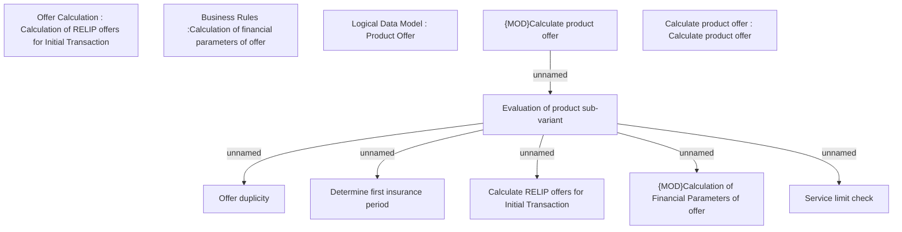

# Evaluation of product sub-variant

```mermaid
graph TD
    Service_limit_check["Service limit check"]
    Offer_Calculation_Calculation_of_RELIP_offers_for_Initial_Tr["Offer Calculation : Calculation of RELIP offers for Initial Transaction"]
    Business_Rules_Calculation_of_financial_parameters_of_offer["Business Rules :Calculation of financial parameters of offer"]
    MOD_Calculation_of_Financial_Parameters_of_offer["{MOD}Calculation of Financial Parameters of offer"]
    Calculate_RELIP_offers_for_Initial_Transaction["Calculate RELIP offers for Initial Transaction"]
    Logical_Data_Model_Product_Offer["Logical Data Model : Product Offer"]
    Determine_first_insurance_period["Determine first insurance period"]
    MOD_Calculate_product_offer["{MOD}Calculate product offer"]
    Calculate_product_offer_Calculate_product_offer["Calculate product offer : Calculate product offer"]
    Offer_duplicity["Offer duplicity"]
    Evaluation_of_product_sub_variant["Evaluation of product sub-variant"]
    Evaluation_of_product_sub_variant -->|unnamed| Offer_duplicity
    Evaluation_of_product_sub_variant -->|unnamed| Determine_first_insurance_period
    Evaluation_of_product_sub_variant -->|unnamed| Calculate_RELIP_offers_for_Initial_Transaction
    Evaluation_of_product_sub_variant -->|unnamed| MOD_Calculation_of_Financial_Parameters_of_offer
    Evaluation_of_product_sub_variant -->|unnamed| Service_limit_check
    MOD_Calculate_product_offer -->|unnamed| Evaluation_of_product_sub_variant
```
