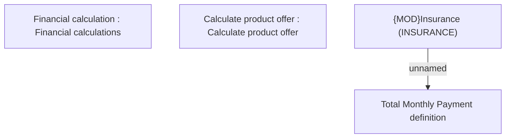

# Offer Calculation algorithm - INSURANCE

```mermaid
graph TD
    Total_Monthly_Payment_definition["Total Monthly Payment definition"]
    Financial_calculation_Financial_calculations["Financial calculation : Financial calculations"]
    Calculate_product_offer_Calculate_product_offer["Calculate product offer : Calculate product offer"]
    MOD_Insurance_INSURANCE["{MOD}Insurance (INSURANCE)"]
    MOD_Insurance_INSURANCE -->|unnamed| Total_Monthly_Payment_definition
```
