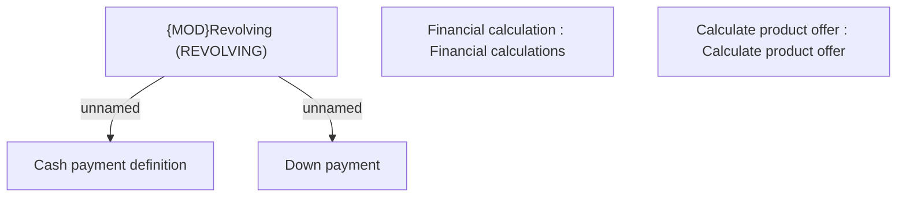

# Offer Calculation algorithm - REVOLVING

- **Diagram Type**: Custom
- **Package**: HomerSelect/BSL/Modules/Product Calculator/Analytical Model/Product Calculator Engine/Business Rules/Traditional Product without Financing Scheme/Calculation type algorithms
- **Diagram ID**: 164313
- **Elements**: 5
- **Connectors**: 2

