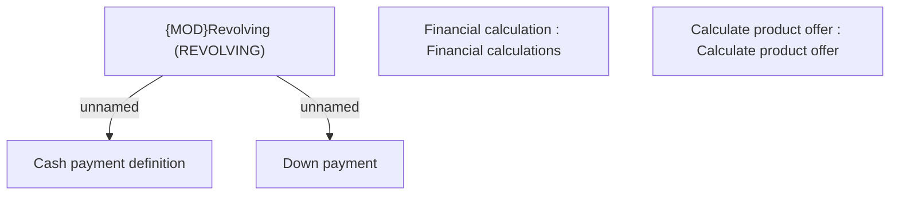

# Offer Calculation algorithm - REVOLVING

```mermaid
graph TD
    Cash_payment_definition["Cash payment definition"]
    Down_payment["Down payment"]
    MOD_Revolving_REVOLVING["{MOD}Revolving (REVOLVING)"]
    Financial_calculation_Financial_calculations["Financial calculation : Financial calculations"]
    Calculate_product_offer_Calculate_product_offer["Calculate product offer : Calculate product offer"]
    MOD_Revolving_REVOLVING -->|unnamed| Cash_payment_definition
    MOD_Revolving_REVOLVING -->|unnamed| Down_payment
```
