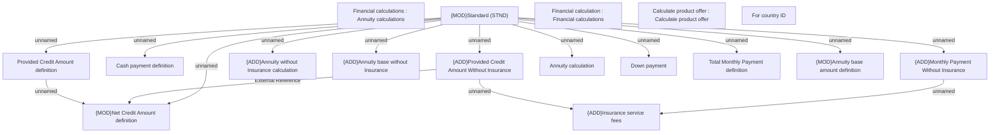

# Offer Calculation algorithm - STANDARD

```mermaid
graph TD
    Provided_Credit_Amount_definition["Provided Credit Amount definition"]
    Cash_payment_definition["Cash payment definition"]
    ADD_Insurance_service_fees["{ADD}Insurance service fees"]
    ADD_Provided_Credit_Amount_Without_Insurance["{ADD}Provided Credit Amount Without Insurance"]
    ADD_Annuity_without_Insurance_calculation["{ADD}Annuity without Insurance calculation"]
    ADD_Annuity_base_without_Insurance["{ADD}Annuity base without Insurance"]
    ADD_Monthly_Payment_Without_Insurance["{ADD}Monthly Payment Without Insurance"]
    MOD_Net_Credit_Amount_definition["{MOD}Net Credit Amount definition"]
    Financial_calculations_Annuity_calculations["Financial calculations : Annuity calculations"]
    Annuity_calculation["Annuity calculation"]
    Down_payment["Down payment"]
    MOD_Standard_STND["{MOD}Standard (STND)"]
    Total_Monthly_Payment_definition["Total Monthly Payment definition"]
    MOD_Annuity_base_amount_definition["{MOD}Annuity base amount definition"]
    Financial_calculation_Financial_calculations["Financial calculation : Financial calculations"]
    Calculate_product_offer_Calculate_product_offer["Calculate product offer : Calculate product offer"]
    For_country_ID["For country ID"]
    MOD_Standard_STND -->|unnamed| Provided_Credit_Amount_definition
    MOD_Standard_STND -->|unnamed| MOD_Annuity_base_amount_definition
    MOD_Standard_STND -->|unnamed| ADD_Provided_Credit_Amount_Without_Insurance
    MOD_Standard_STND -->|unnamed| Down_payment
    MOD_Standard_STND -->|unnamed| Cash_payment_definition
    MOD_Standard_STND -->|unnamed| ADD_Monthly_Payment_Without_Insurance
    MOD_Standard_STND -->|unnamed| ADD_Annuity_without_Insurance_calculation
    MOD_Standard_STND -->|unnamed| Total_Monthly_Payment_definition
    MOD_Standard_STND -->|unnamed| Annuity_calculation
    MOD_Standard_STND -->|unnamed| MOD_Net_Credit_Amount_definition
    MOD_Standard_STND -->|unnamed| ADD_Annuity_base_without_Insurance
    ADD_Provided_Credit_Amount_Without_Insurance -->|External Reference| MOD_Net_Credit_Amount_definition
    Provided_Credit_Amount_definition -->|unnamed| MOD_Net_Credit_Amount_definition
    ADD_Monthly_Payment_Without_Insurance -->|unnamed| ADD_Insurance_service_fees
    ADD_Provided_Credit_Amount_Without_Insurance -->|unnamed| ADD_Insurance_service_fees
```
