# Offer Calculation algorithms

- **Diagram Type**: Custom
- **Package**: HomerSelect/BSL/Modules/Product Calculator/Analytical Model/Product Calculator Engine/Business Rules/Traditional Product without Financing Scheme/Calculation type algorithms
- **Diagram ID**: 164314
- **Elements**: 12
- **Connectors**: 12

```mermaid
graph TD
    Calculation_type_algorithms_Offer_Calculation_algorithm_INSU["Calculation type algorithms : Offer Calculation algorithm - INSURANCE"]
    MOD_Insurance_INSURANCE["{MOD}Insurance (INSURANCE)"]
    Calculate_product_offer_Calculate_product_offer["Calculate product offer : Calculate product offer"]
    Offer_Calculation_algorithms_Offer_Calculation_algorithm_REV["Offer Calculation algorithms : Offer Calculation algorithm - REVOLVING"]
    Offer_Calculation_algorithms_Offer_Calculation_algorithm_STA["Offer Calculation algorithms :Offer Calculation algorithm - STANDARD"]
    Offer_Calculation_algorithms_Offer_calculation_algorithms_CF["Offer Calculation algorithms : Offer calculation algorithms - CFR, CFR_CP, FFR_AI"]
    MOD_Offer_Calculation_Algorithm["{MOD}Offer Calculation Algorithm"]
    MOD_Revolving_REVOLVING["{MOD}Revolving (REVOLVING)"]
    MOD_Standard_STND["{MOD}Standard (STND)"]
    DEL_Calculated_flat_rate_and_cash_payment_CFR_CP["{DEL}Calculated flat rate and cash payment (CFR_CP)"]
    DEL_Fixed_flat_rate_and_fixed_number_of_advance_payments_FFR["{DEL}Fixed flat rate and fixed number of advance payments (FFR_AI)"]
    DEL_Calculated_flat_rate_CFR["{DEL}Calculated flat rate (CFR)"]
    DEL_Calculated_flat_rate_CFR -->|unnamed| MOD_Offer_Calculation_Algorithm
    DEL_Calculated_flat_rate_CFR -->|unnamed| Offer_Calculation_algorithms_Offer_calculation_algorithms_CF
    DEL_Fixed_flat_rate_and_fixed_number_of_advance_payments_FFR -->|unnamed| MOD_Offer_Calculation_Algorithm
    DEL_Fixed_flat_rate_and_fixed_number_of_advance_payments_FFR -->|unnamed| Offer_Calculation_algorithms_Offer_calculation_algorithms_CF
    DEL_Calculated_flat_rate_and_cash_payment_CFR_CP -->|unnamed| MOD_Offer_Calculation_Algorithm
    DEL_Calculated_flat_rate_and_cash_payment_CFR_CP -->|unnamed| Offer_Calculation_algorithms_Offer_calculation_algorithms_CF
    MOD_Standard_STND -->|unnamed| MOD_Offer_Calculation_Algorithm
    MOD_Standard_STND -->|unnamed| Offer_Calculation_algorithms_Offer_Calculation_algorithm_STA
    MOD_Revolving_REVOLVING -->|unnamed| MOD_Offer_Calculation_Algorithm
    MOD_Revolving_REVOLVING -->|unnamed| Offer_Calculation_algorithms_Offer_Calculation_algorithm_REV
    MOD_Insurance_INSURANCE -->|unnamed| MOD_Offer_Calculation_Algorithm
    MOD_Insurance_INSURANCE -->|unnamed| Calculation_type_algorithms_Offer_Calculation_algorithm_INSU
```

